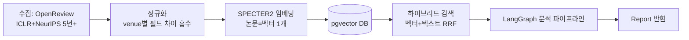
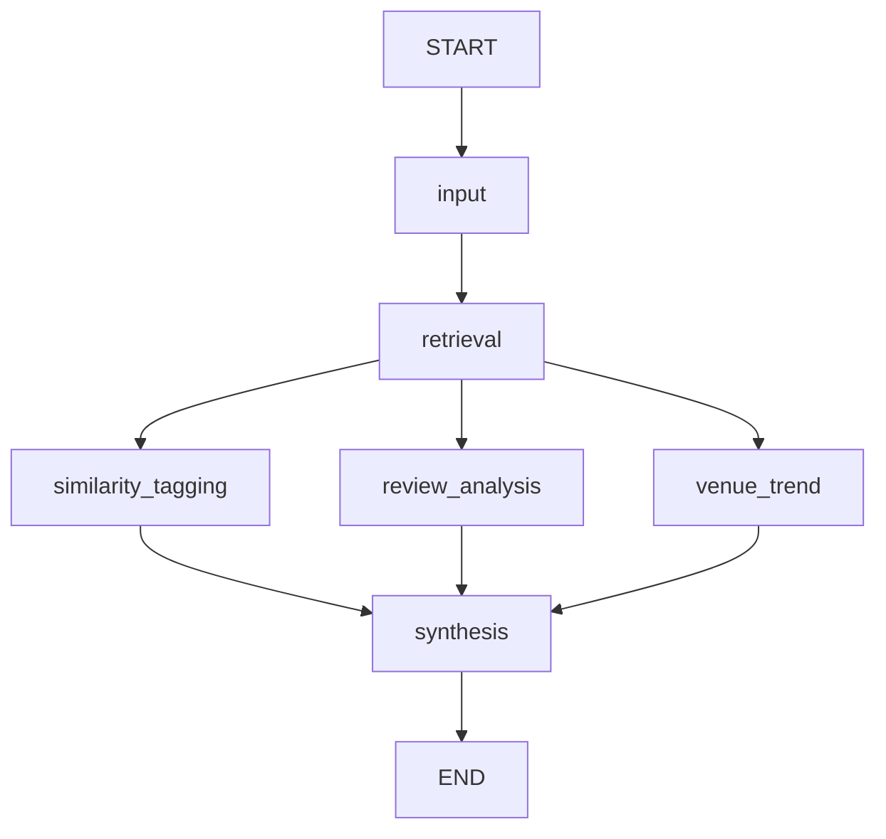

# AI 파트 팀 공유 자료

> 대상: 프론트엔드 · 백엔드 팀원. "AI 파트가 뭘 하고, 왜 이렇게 만들었고, 우리 쪽에서는 뭘 알아야 하는지"만 빠르게 파악하도록 정리했다.
> 더 깊은 내용(스키마, 실험 수치, 실패한 접근)은 [AI_파트_설계서.md](AI_파트_설계서.md)에 §번호로 남아있다. 이 문서는 그걸 다 안 읽어도 되게 하는 요약본이다.

---

## 1. 이 파트가 하는 일 (한 문장)

논문 제목/초록(또는 PDF)을 넣으면, **비슷한 논문들을 찾아서 리뷰 히스토리를 분석**해 "이 연구가 어떤 지적을 받을지, 어느 학회에 내면 붙을 가능성이 높은지"를 알려준다.

```python
from paper_assistant import analyze
report = analyze(title, abstract)   # -> Report (Pydantic)
```

백엔드가 통합할 때 알아야 할 건 이 함수 하나와 `Report` 스키마뿐이다. 내부 구현(DB, 임베딩 모델, LangGraph)은 몰라도 된다.

---

## 2. 전체 그림



- **왼쪽 절반(수집~DB)**: 한 번 돌려서 채워두는 배치 작업. 이미 완료됨(43,515편, 리뷰 168,217건).
- **오른쪽 절반(검색~Report)**: 사용자 질문마다 실시간으로 도는 부분. 백엔드가 호출하는 게 이 부분.

---

## 3. 왜 이렇게 만들었나 — 핵심 결정과 이유

팀 전체가 "왜?"를 물을 만한 지점만 추렸다.

### 3.1 그래프DB 없이 pgvector만 쓴다
논문 간 관계(인용, 재투고)가 복잡해 보이지만 실제 필요한 건 "벡터 검색 + 몇 개 조인"이 전부였다. Postgres 하나로 충분해서 별도 그래프DB(Neo4j 등) 없이 pgvector 확장만 썼다. 인프라를 하나 줄인 셈이다.

### 3.2 논문 = 벡터 1개 (청킹 안 함)
일반 RAG처럼 문서를 청크로 쪼개지 않는다. 여기선 "이 논문 전체가 저 논문과 비슷한가"를 물어야 하므로, 제목+초록을 통째로 SPECTER2(과학 논문 전용 임베딩 모델)에 넣어 벡터 1개로 표현한다. CPU로도 43,515편을 47분 만에 처리할 만큼 가볍다.

### 3.3 LangGraph는 "고정 DAG"이지 에이전트가 아니다
검색 → (유사성 태깅 ‖ 리뷰 분석 ‖ 게재 경향 분석) → 종합, 이 흐름은 매 요청마다 항상 동일하다. 그래서 LLM이 다음 단계를 판단하는 supervisor 패턴을 쓰지 않고, 그냥 고정된 병렬 DAG로 짰다. **왜 이게 중요한가**: 디버깅이 쉽고, LLM 호출이 라우팅 판단에 낭비되지 않는다.



### 3.4 LLM은 껐다 켰다 할 수 있다 (예산 보호)
팀 예산이 넉넉하지 않아서, 기본값은 **LLM 완전 off ($0)**다. 이 상태에서도 파이프라인 전체가 스텁으로 동작해 배선을 검증할 수 있다. 실제 데모/시연 때만 환경변수로 켠다.

```bash
PAPER_ASSISTANT_USE_LLM=1   # Haiku(추출) + Sonnet(종합) 실제 호출
```

### 3.5 검색은 "벡터+텍스트"를 순위로 합친다 (RRF)
초반에 벡터 유사도만으로 "이 논문이 저 논문보다 몇 % 더 비슷하다" 같은 점수를 만들려 했는데, 실측해보니 **불가능**했다(아래 4.1). 그래서 벡터 검색 순위와 텍스트 검색(Postgres full-text) 순위를 RRF(Reciprocal Rank Fusion)로 합치는 방식으로 바꿨다 — 절대값이 아니라 순위 기반이라 이 문제를 우회한다.

---

## 4. 다른 파트 팀원이 반드시 알아야 할 함정 4가지

이건 실제로 부딪혀서 고친 것들이라, 프론트/백엔드가 `Report`를 다룰 때 같은 실수를 반복하지 않으려면 꼭 읽어야 한다.

### 4.1 "이 논문과 87% 유사합니다" 같은 점수는 절대 못 만든다
SPECTER2 임베딩의 코사인 유사도는 검색 결과 상위 20개 안에서 폭이 **0.013**밖에 안 된다. 1위든 20위든 사실상 같은 숫자라, 어떤 수학적 변환을 해도 순위를 정당화할 점수가 안 나온다.

→ `Report.similar_papers[i]`에는 유사도 점수 대신 `rank`(순위)와 `match_type`(`semantic`/`lexical`/`both` — 왜 걸렸는지)이 들어간다. **프론트에서 "유사도 92%" 같은 UI를 만들면 안 된다.** 대신 "N번째로 유사"나 매치 이유를 보여주는 게 맞다.

### 4.2 대신 "이 검색 결과 자체를 믿어도 되는지"는 잘 갈린다
논문 개별 점수는 못 갈라도, 쿼리(사용자가 넣은 논문) 자체가 우리 도메인(ML/AI 논문) 안에 있는지는 뚜렷하게 갈린다. 도메인 안 쿼리는 top-5 평균 코사인이 0.946~0.966, 도메인 밖은 0.852~0.867로 겹치지 않는다.

→ `Report.confidence.level`(`strong`/`moderate`/`weak`)과 `is_reliable`을 꼭 확인해서, `weak`일 땐 프론트가 "이 결과는 신뢰도가 낮습니다" 경고를 보여줘야 한다. 이게 없으면 엉뚱한 주제(예: 요리 레시피)를 넣어도 ML 논문 20편과 분석을 그럴듯하게 뱉어버린다.

### 4.3 리뷰 지적 빈도를 그대로 순위 매기면 안 된다
"20편 중 17편이 baselines 부족 지적을 받았다"는 언뜻 중요해 보이지만, 사실 코퍼스 전체 논문의 78.8%가 이 지적을 받는다 — 즉 정보량이 거의 0이다.

→ `ReviewPattern`에는 `lift`(코퍼스 평균 대비 얼마나 두드러지는지)와 `is_distinctive`, 그리고 이 지적을 받은 논문 vs 안 받은 논문의 당락 차이(`is_contrast_significant`)가 같이 담긴다. 프론트는 빈도순이 아니라 이 값들 기준으로 강조해야 한다.

### 4.4 리뷰 점수(rating)와 채택률은 원점수/절대값으로 보여주면 안 된다
- 척도가 venue마다 다르다 (ICLR 2020만 1~8점, 나머지는 1~10점).
- NeurIPS는 OpenReview가 **채택된 논문 위주로만 공개**해서 코퍼스의 95%가 accept로 보인다 (실제 채택률은 ~25%). `is_coverage_biased`가 참인 venue는 채택률을 그대로 보여주면 완전히 왜곡된다.

→ `rating_vs_venue`(그 학회 평균 대비), `rating_vs_threshold`(당락 경계 대비), `accept_lift`(코퍼스 자체 대비 상대값) 같은 **상대값**만 쓴다. `is_coverage_biased`가 true인 venue는 accept율 절대 수치를 노출하지 말 것.

---

## 5. 백엔드가 알아야 할 것

### 통합 계약 (이게 전부)
```python
from paper_assistant import (
    analyze, get_paper_detail, get_paper_reviews, get_paper_revisions)

report = analyze(title, abstract, pdf_bytes=None)  # -> Report (Pydantic, JSON 직렬화 가능)
```
- Python 패키지로 제공된다 (백엔드도 Python이라 별도 API 서버 안 거쳐도 import해서 바로 씀).
- `pdf_bytes`를 주면 내부에서 제목/초록을 추출해서 쓴다 — 프론트가 PDF 업로드를 받는 경우 그대로 넘기면 된다.
- 반환값 `Report`는 Pydantic이라 `.model_dump_json()`으로 바로 JSON 응답 가능.

### 실행 준비
```bash
pip install -r requirements.txt
docker compose up -d   # pgvector DB, 포트 5433
```
DB는 이미 43,515편 + 리뷰 168,217건 + 지적항목 125만 건 적재 완료 상태. 별도 수집 없이 바로 `analyze()` 호출 가능.

### 비용
기본은 `$0`(LLM off, 스텁 응답으로 배선 확인). 실제 서비스에 붙일 땐 `PAPER_ASSISTANT_USE_LLM=1`로 Haiku(리뷰 추출)/Sonnet(종합) 호출이 켜진다 — 트래픽 늘기 전에 비용 견적을 같이 확인하자.

---

## 6. 프론트엔드가 알아야 할 것

`Report`의 섹션별로 렌더링하면 된다:

| 필드 | 내용 | UI 주의사항 |
|---|---|---|
| `confidence` | 이 검색 결과를 믿을 수 있는지 | `weak`면 결과 위에 경고 배너 필수 (4.2) |
| `similar_papers` | 유사 논문 리스트 | 유사도 %가 아니라 `rank`+`match_type`으로 표시 (4.1) |
| `review_patterns` | 반복되는 리뷰 지적 패턴 | 빈도순 아니라 `is_distinctive` 기준으로 강조 (4.3) |
| `venue_trends` | 학회별 게재 경향 | `is_coverage_biased`면 accept율 절대 수치 숨기고 `accept_lift`만 (4.4) |
| `rating_context` | 이웃 논문들 점수 분포·당락 경계 | 원점수 아니라 상대값 필드 사용 (4.4) |
| `resubmission_flows` | A학회 reject → B학회 accept 흐름 | 그대로 표시 가능 |
| `summary_markdown` | 사람이 읽는 종합 요약 (마크다운) | 그대로 렌더링. `[E1]`/`[M1]` 표기는 `evidence`의 label |
| `evidence` | 요약이 인용한 **실제 리뷰·메타리뷰 원문** | `citations`에 있는 라벨만 골라 각주로 보여주면 된다. `from_unsplit_review=true`면 '지적'이라 단정 금지 |
| `citations` | 실제로 인용된 라벨 목록 | 지어낸 라벨은 걸러졌으므로 **링크는 항상 유효**하다. 다만 문장이 그 원문에서 나온 내용인지까지는 검증되지 않으니, 원문을 함께 보여줘 사용자가 판단하게 할 것 |
| `used_llm` | 이 리포트가 실제 LLM 호출로 나왔는지 | 근거 추적용. `false`면 태깅·요약이 스텁이다 |

데모 화면(`demo/`)이 이 계약을 그대로 쓰는 참고 구현이다 — `demo/server.py`,
`demo/static/index.html`을 보면 각 필드를 어떻게 화면에 배치했는지 바로 알 수 있다.
프론트 연동이 끝나면 `demo/` 폴더는 통째로 지워도 된다(독립 폴더).

백엔드가 이 계약을 감싸 노출하는 실제 엔드포인트 목록은
[DEVELOPMENT.md](DEVELOPMENT.md) §7에 있다 (Swagger는 `/docs`).

---

## 7. 지금 상태

- ✅ 수집 완료: ICLR 2020–2025 + NeurIPS 2021–2024, 논문 43,515편 / 리뷰 168,217건 / 지적항목 1,253,330건
- ✅ 검색(하이브리드+신뢰도 판정), 분석 파이프라인(유사성 태깅/리뷰 패턴/게재 경향/재투고 매칭), `Report` 스키마까지 AI 파트 MVP 기능 전부 완성
- ✅ 테스트 99건 통과
- 🔲 남은 선택 사항(우선순위 낮음): Haiku/Sonnet 실제 호출 비용 실측, 리뷰 포인트 사전 임베딩

질문이나 통합 중 막히는 부분 있으면 언제든 물어봐도 됨 — 이 문서에 없는 세부사항은 [AI_파트_설계서.md](AI_파트_설계서.md)에 다 있다.
